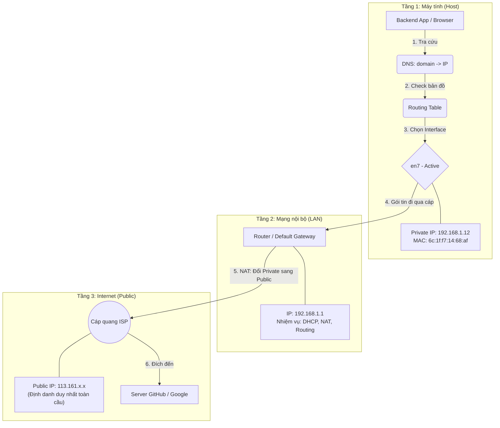

# TỔNG THỂ KIẾN TRÚC: TỪ CODE RA THẾ GIỚI

Dưới đây là sơ đồ dòng chảy của một gói tin (packet) khi bạn thực hiện một request từ máy cá nhân.

```mermaid
graph TD
    subgraph "Tầng 1: Máy tính (Host)"
        A[Backend App / Browser] -->|1. Tra cứu| B(DNS: domain -> IP)
        B -->|2. Check bản đồ| C(Routing Table)
        C -->|3. Chọn Interface| D{en7 - Active}
        D --- E["Private IP: 192.168.1.12<br/>MAC: 6c:1f:f7:14:68:af"]
    end

    subgraph "Tầng 2: Mạng nội bộ (LAN)"
        D -->|4. Gói tin đi qua cáp| F[Router / Default Gateway]
        F --- G["IP: 192.168.1.1<br/>Nhiệm vụ: DHCP, NAT, Routing"]
    end

    subgraph "Tầng 3: Internet (Public)"
        F -->|5. NAT: Đổi Private sang Public| H((Cáp quang ISP))
        H --- I["Public IP: 113.161.x.x<br/>(Định danh duy nhất toàn cầu)"]
        H -->|6. Đích đến| J[Server GitHub / Google]
    end
```
