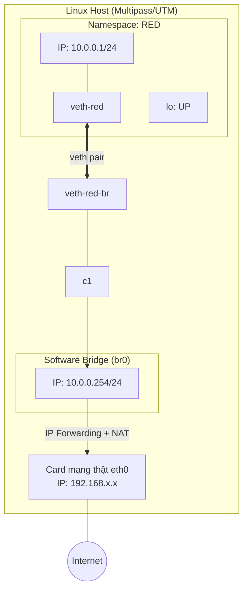

# 1. Tổng quan Kiến trúc (Architecture)

Mục tiêu là xây dựng một mạng ảo cô lập nhưng vẫn có khả năng giao tiếp với bên ngoài.

```mermaid
graph TD
    subgraph "Linux Host (Multipass/UTM)"
        direction TB
        eth0[Card mạng thật eth0 <br/> IP: 192.168.x.x]

        subgraph "Software Bridge (br0)"
            br0_IP["IP: 10.0.0.254/24"]
        end

        veth_red_br[veth-red-br] <--- c1 ---> br0_IP

        subgraph "Namespace: RED"
            veth_red[veth-red]
            IP_red["IP: 10.0.0.1/24"]
            lo_red[lo: UP]
            IP_red --- veth_red
        end

        veth_red <== "veth pair" ==> veth_red_br
    end

    br0_IP -->|IP Forwarding + NAT| eth0
    eth0 --- Internet((Internet))
```
