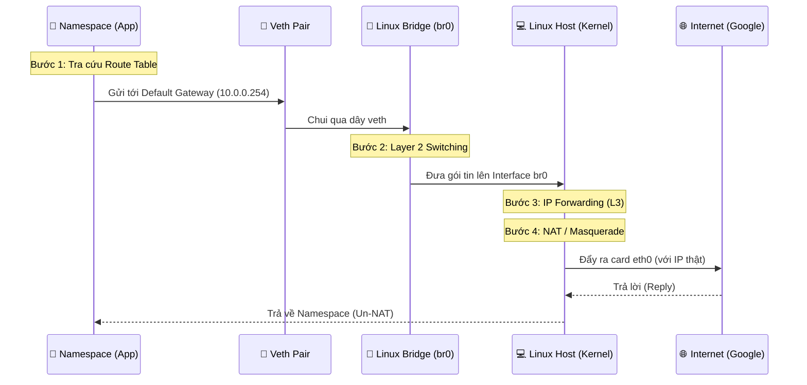

# Workflow: Hành trình của Gói tin (Packet Journey)

Để một gói tin từ một vùng cô lập (Namespace) đi ra được Internet, nó phải vượt qua 5 trạm kiểm soát chính. Nếu bất kỳ trạm nào gặp sự cố, gói tin sẽ bị "kẹt" lại ngay lập tức.

## 🏗️ Kiến trúc Mô phỏng (Packet Flow Architecture)

Dưới đây là sơ đồ trình tự thể hiện đường đi của gói tin:

