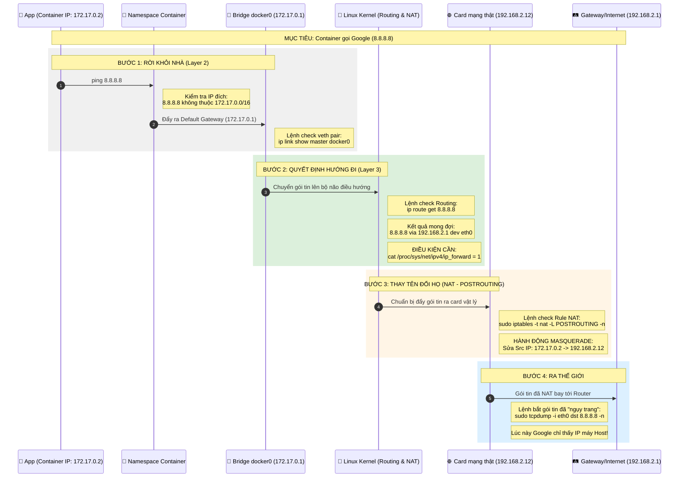

# Docker Networking: Single Host

## Sơ đồ luồng: Container đơn lẻ ra Internet (Single Host)



## 🔍 Các "Chốt chặn" và cách kiểm tra chi tiết:

### 1. Kiểm tra "Dây cáp ảo" (Veth Pair)
Làm sao biết Container đã nối đúng vào Bridge docker0 chưa?

**Lệnh:**
```bash
brctl show docker0
# hoặc
ip link show master docker0
```

**Xác nhận:** Nếu bạn thấy một interface dạng `vethxxxx`, nghĩa là "dây" đã cắm. Nếu không thấy, container bị cô lập hoàn toàn.

### 2. Kiểm tra "Quyền chuyển tiếp" (The Forwarding Key)
Dù bảng route đúng, nhưng nếu Kernel không cho phép gói tin nhảy từ card này sang card khác, nó sẽ bị drop.

**Lệnh:**
```bash
sysctl net.ipv4.ip_forward
```

**Xác nhận:** Phải bằng `1`. Đây chính là cái "chốt cửa" giữa `docker0` và `eth0`.

### 3. Kiểm tra "Tấm mặt nạ" (NAT/Masquerade)
Tại sao phải NAT? Vì Internet không biết `172.17.x.x` là ai. Máy Host phải đứng ra "đại diện".

**Lệnh:**
```bash
sudo iptables -t nat -S POSTROUTING
```

**Soi dòng chữ:** `-A POSTROUTING -s 172.17.0.0/16 ! -o docker0 -j MASQUERADE`

**Ý nghĩa:** "Mọi thứ từ dải Docker đi ra ngoài (không phải quay lại docker0) thì hãy dán nhãn IP của máy Host vào".

### 4. Mô phỏng Route (Pattern 3C)
Khi bạn gõ `ip route get 8.8.8.8`:

- **Cái gì (Dest):** `8.8.8.8`
- **Cổng nào (Dev):** `eth0` (Card thật)
- **Của ai (Via):** `192.168.2.1` (Router nhà mạng)
