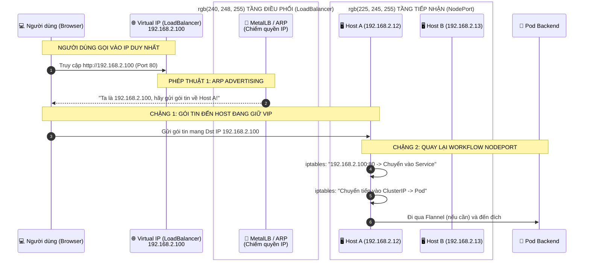

# Kubernetes LoadBalancer Networking

### 3 Điểm "Bản chất" của LoadBalancer locally:
1. **Sự "Chiếm hữu" IP (ARP/BGP)**
Tại sao bạn gõ IP 192.168.2.100 mà gói tin lại biết chui vào Host A?

Bản chất: Trong mạng nội bộ, các máy tìm nhau qua địa chỉ MAC. Một phần mềm (như MetalLB) sẽ đứng ra nói dối với cả mạng LAN rằng: "Địa chỉ MAC của Host A hiện tại cũng chính là địa chỉ của IP 192.168.2.100".

Khi đó, toàn bộ traffic đổ dồn về Host A.

2. **LoadBalancer là một "vỏ bọc" của NodePort**
Khi bạn dùng dịch vụ Cloud, thực chất Cloud Provider tạo ra một con LoadBalancer vật lý/phần mềm nằm ngoài Cluster. Con đó sẽ check: "Node A còn sống không? Node B còn sống không?". Sau đó nó mới forward traffic vào các NodePort tương ứng.

3. **Sự khác biệt Cloud vs Local**
Local (MetalLB): Một Node trong Cluster sẽ "đóng vai" LoadBalancer bằng cách mượn thêm một IP phụ.

Cloud (NLB/ALB): Một thiết bị chuyên dụng của Amazon/Google sẽ đứng ngoài hoàn toàn, tách biệt với tài nguyên tính toán của các Node.
