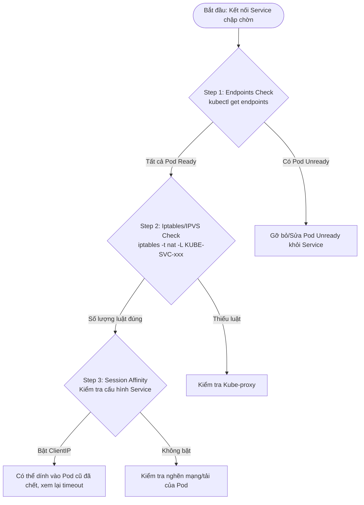
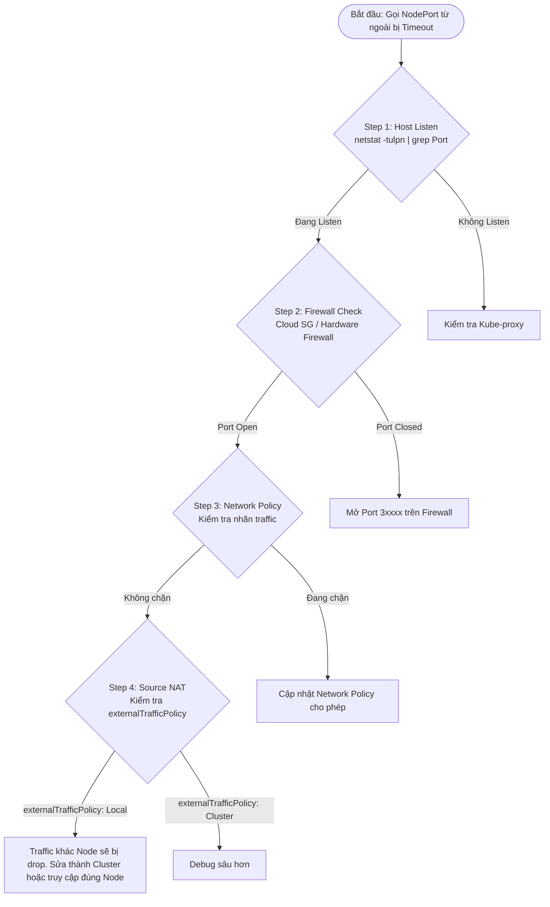

# K8s Networking Debugging Best Practices

## 🛠️ Quy tắc chung khi Debug Networking (The Golden Rules)

> "Traffic không bao giờ tự biến mất, nó chỉ bị bẻ lái hoặc bị chặn."

*   **Bottom-Up (Từ dưới lên):** Kiểm tra hạ tầng vật lý (Node) -> CNI (Flannel) -> K8s Logic (Service/Endpoint) -> Policy.
*   **Inside-Out (Từ trong ra):** Thử từ trong Pod trước, sau đó mới thử từ máy Host, rồi mới thử từ ngoài Internet.
*   **Bám theo địa chỉ:** Luôn xác định 3 thông số: Source IP, Destination IP, và Port/Protocol.

---

## 📋 Checklist 3 Case Networking "Kinh điển"

### 🔴 Case 1: "Pod A không gọi được Pod B (Cùng Cluster)"

**Triệu chứng:** Connection Timeout hoặc No route to host.

```mermaid
flowchart TD
    Start([Bắt đầu: Pod A gọi Pod B lỗi]) --> Step1{"Step 1: IP Check<br>kubectl get pod -o wide"}
    Step1 -- Pod B Running & Có IP --> Step2{"Step 2: Connectivity<br>ping/curl trực tiếp IP Pod B"}
    Step1 -- Pod B lỗi/Chưa có IP --> FixPod[Sửa lỗi Pod B]

    Step2 -- OK --> SvcError[Lỗi nằm ở Service]
    Step2 -- Fail --> Step3{"Step 3: CNI Check<br>ip addr show flannel.1"}

    Step3 -- UP trên 2 Node --> Step4{"Step 4: Route Check<br>ip route"}
    Step3 -- DOWN --> FixCNI[Sửa lỗi CNI/Flannel]

    Step4 -- Có đường dẫn --> DeepDebug[Debug sâu hơn: tcpdump, firewall]
    Step4 -- Không có đường dẫn --> FixRoute[Sửa bảng định tuyến (Routing table)]
```

*   **Step 1 (IP Check):** `kubectl get pod -o wide`. Pod B có IP chưa? Status có Running không?
*   **Step 2 (Connectivity):** `ping` hoặc `curl` trực tiếp IP của Pod B từ Pod A.
    *   Nếu OK: Lỗi nằm ở Service.
    *   Nếu Fail: Chuyển sang Step 3.
*   **Step 3 (CNI Check):** Kiểm tra `flannel.1` trên cả 2 Node. `ip addr show flannel.1`. Interface có UP không?
*   **Step 4 (Route Check):** `ip route`. Trên Host A có đường dẫn tới dải IP của Host B không?

---

### 🟡 Case 2: "Service gọi lúc được lúc không"

**Triệu chứng:** Kết nối chập chờn, lúc thì 200 OK, lúc thì Timeout.



*   **Step 1 (Endpoints Check):** `kubectl get endpoints <service-name>`.
    *   Check: Có Pod nào đang bị Unready không? Nếu có 3 Pod mà 1 Pod chết, 33% request sẽ tèo.
*   **Step 2 (Iptables/IPVS Check):** Soi luật bẻ lái. `sudo iptables -t nat -L KUBE-SVC-xxx`.
    *   Check: Các dòng `KUBE-SEP` có đủ số lượng như số Pod không?
*   **Step 3 (Session Affinity):** Kiểm tra Service có đang bật `sessionAffinity: ClientIP` không? Đôi khi lỗi do việc duy trì kết nối cũ tới một Pod đã chết.

---

### 🔵 Case 3: "Gọi vào NodePort từ bên ngoài bị chặn"

**Triệu chứng:** Chỉ gọi được từ nội bộ, gọi từ ngoài vào bị Timeout.



*   **Step 1 (Host Listen):** `netstat -tulpn | grep <Port>`. Máy Host có thực sự đang lắng nghe trên cổng đó không? (Do kube-proxy quản lý).
*   **Step 2 (Cloud/Hardware Firewall):** Kiểm tra Firewall của Multipass/AWS/Security Group. Cổng `3xxxx` đã được "Open" chưa?
*   **Step 3 (Network Policy):** Kiểm tra xem có Policy nào đang chặn traffic không mang nhãn (Identity-less traffic) không.
*   **Step 4 (Source NAT):** Kiểm tra `externalTrafficPolicy`. Nếu để là `Local`, traffic gọi vào Node A nhưng Pod ở Node B sẽ bị Drop.

---

## 🔍 Toolbelt: Các lệnh "Thần thánh" cho DevOps

| Lệnh | Mục đích |
| :--- | :--- |
| `kubectl get ep` | Kiểm tra "danh bạ" IP thật của Service. |
| `kubectl run -it --rm debug --image=busybox` | Tạo một Pod tạm để "đứng từ trong" test mạng. |
| `tcpdump -i any port 4789 -vv` | Soi gói tin "đóng thùng" VXLAN của Flannel. |
| `conntrack -L -p tcp --dport 80` | Soi "sổ hộ khẩu" xem gói tin đã về tới Host chưa. |
| `iptables-save \| grep <Service-IP>` | Xuất toàn bộ "ma trận" bẻ lái của một Service cụ thể. |
