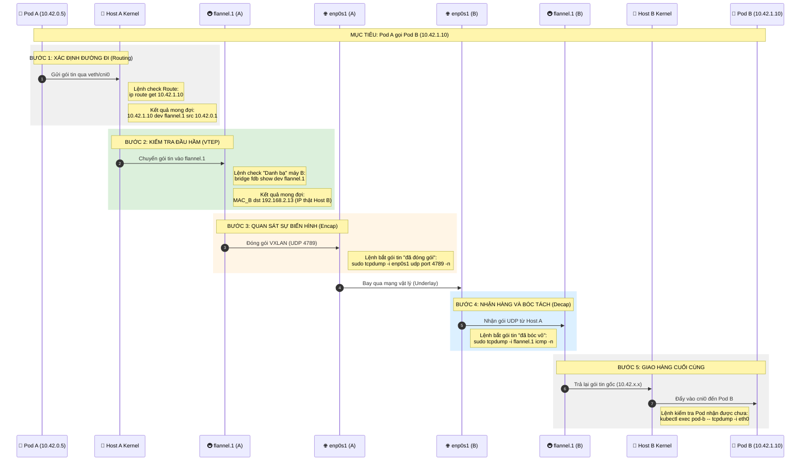
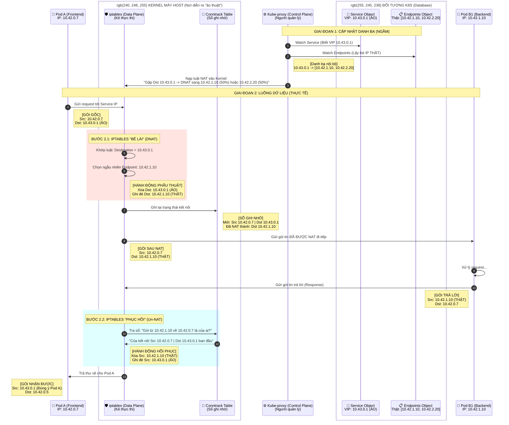

# Kubernetes Networking

## k8s Siêu Sơ Đồ: Giải Phẫu & Truy Vết K8s Networking



### Chi tiết các vị trí kiểm tra (Pattern thực chiến)

Để đảm bảo thông tin là đúng, bạn hãy thực hiện kiểm tra theo thứ tự "Điểm kiểm soát" sau:

#### 1. Kiểm tra "Bản đồ" trên Host A (The Map)
Lệnh này giúp bạn biết Kernel định ném gói tin đi đâu ngay từ đầu.
- **Lệnh**: `ip route get 10.42.1.10`
- **Phân tích**:
  - Nếu nó hiện `dev flannel.1` ➔ Đúng, K8s đã học được đường sang máy B.
  - Nếu nó hiện `via 192.168.2.1` ➔ Sai, nó đang định ném ra Internet (K8s chưa học được mạng Overlay).

#### 2. Kiểm tra "Địa chỉ thật" của máy B (The Directory)
Làm sao `flannel.1` biết 192.168.2.13 là thằng giữ dải IP kia? Nó nằm trong bảng FDB (Forwarding Database).
- **Lệnh**: `bridge fdb show dev flannel.1`
- **Điểm cần soi**: Tìm dòng có chứa IP thật của máy B. Đây chính là "sợi dây" liên kết giữa mạng ảo (10.42.x.x) và mạng thật (192.168.x.x).

#### 3. Kiểm tra "Đóng gói" trên đường truyền (The Tunnel)
Dùng lệnh này trên card mạng thật để thấy gói tin "biến hình":
- **Lệnh**: `sudo tcpdump -i enp0s1 udp port 4789 -vv -X`
- **Giải mã**: Flag `-X` sẽ giúp bạn nhìn thấy nội dung gói tin. Bạn sẽ thấy bên ngoài là IP của Host A/B, nhưng sâu bên trong đống mã HEX là IP của Pod A/B.

#### 4. Kiểm tra "Láng giềng" (Neighbor)
K8s cần biết địa chỉ MAC của các interface ảo.
- **Lệnh**: `ip neighbor show dev flannel.1`
- **Ý nghĩa**: Nếu dòng này trống, nghĩa là máy A chưa bao giờ "nói chuyện" được với `flannel.1` của máy B.

---

🏁 **Tổng kết Pattern kiểm tra nhanh**:
- Chưa ping được? ➔ Check `ip route` (Bản đồ có sai không?).
- Route đúng nhưng vẫn timeout? ➔ Check `bridge fdb` (Có biết IP thật của máy kia không?).
- FDB đúng? ➔ Check `tcpdump -i enp0s1` (Gói tin có thực sự bay ra khỏi card mạng không?).

## k8s ClusterIP Service: Luồng dữ liệu và NAT



### 🔍 Chú thích chi tiết (Visualized Key Points)
Hãy nhìn vào sơ đồ và đối chiếu với các điểm sau để thấy rõ "bản chất" của chúng:

#### 1. Thể hiện rõ "Service IP (VIP) là 10.43.0.1"
- **Trên sơ đồ**: Nhìn vào đối tượng 📛 Service Object (VIP: 10.43.0.1).
- **Đặc điểm**: Nó nằm trong box "ĐỐI TƯỢNG K8S (Database)". Nghĩa là nó chỉ là một dòng dữ liệu cấu hình.
- **Bằng chứng "ẢO"**: Nhìn vào Gói gốc (Bước 3) và Gói sau NAT (Bước 7). IP 10.43.0.1 biến mất ngay khi chạm vào Kernel (Bước 4). Nó không bao giờ bay ra khỏi card mạng thật.

#### 2. Thể hiện rõ "Endpoints là gì?"
- **Trên sơ đồ**: Nhìn vào đối tượng 📋 Endpoints Object (Thật: [10.42.1.10, 10.42.2.20]).
- **Bản chất**: Đây chính là cái "Danh bạ IP thật". Kube-proxy (Bước 1 & 2) lấy dữ liệu từ đây để biết đường mà nạp luật vào iptables.
- **Bằng chứng "THẬT"**: Nhìn vào Gói sau NAT (Bước 7). Địa chỉ Destination đã trở thành 10.42.1.10. Đây là IP của một card mạng thật, một Pod thật đang chạy.

#### 3. Vai trò của iptables (Kẻ thực thi "phẫu thuật")
- **Trên sơ đồ**: Box "BƯỚC NHẢY IPTABLES" (Bước 4-6) hoặc BƯỚC 2.1: IPTABLES "BẺ LÁI".
- **Hành động**: Nó thực hiện việc xóa IP ảo và ghi đè IP thật trực tiếp lên gói tin. Đây không phải là route, đây là Destination NAT (DNAT).

#### 4. Vai trò của Conntrack (Cuốn sổ ghi nhớ đường về)
- **Trên sơ đồ**: Box "BƯỚC HỒI PHỤC" (Bước 11-13) hoặc BƯỚC 2.2: IPTABLES "PHỤC HỒI".
- **Tác dụng**: Nếu không có bước tra sổ (Bước 11) và phục hồi (Bước 12), Pod A sẽ nhận được thư từ 10.42.1.10 và nó sẽ từ chối nhận vì nó đang chờ phản hồi từ 10.43.0.1. Conntrack giúp "đóng kịch" cho đến phút cuối cùng.

### 🛠️ Cách để bạn "thấy" sự biến mất của Service IP trên thực tế:
Bạn hãy dùng tcpdump trên host-a để bắt gói tin khi đang curl đến Service IP:

1. **Bắt gói tin trên card veth của Pod A (Trước NAT)**:
   ```bash
   tcpdump -i vethxxxx host 10.43.0.1
   ```
   ➔ Bạn sẽ thấy IP đích là 10.43.0.1.

2. **Bắt gói tin trên card enp0s1 (Sau NAT)**:
   ```bash
   tcpdump -i enp0s1 host 10.43.0.1
   ```
   ➔ Bạn sẽ KHÔNG thấy gói tin nào. Vì lúc này gói tin đã mang IP đích của Pod Backend (10.42.1.10).
