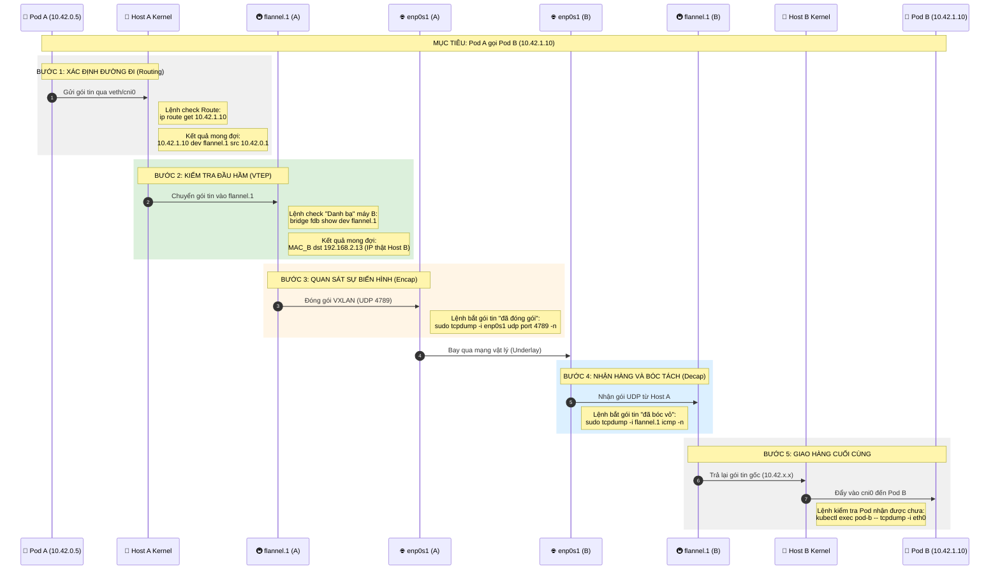

# Kubernetes Networking

## k8s Siêu Sơ Đồ: Giải Phẫu & Truy Vết K8s Networking

### Chi tiết các vị trí kiểm tra (Pattern thực chiến)

Để đảm bảo thông tin là đúng, bạn hãy thực hiện kiểm tra theo thứ tự "Điểm kiểm soát" sau:

#### 1. Kiểm tra "Bản đồ" trên Host A (The Map)
Lệnh này giúp bạn biết Kernel định ném gói tin đi đâu ngay từ đầu.
- **Lệnh**: `ip route get 10.42.1.10`
- **Phân tích**:
  - Nếu nó hiện `dev flannel.1` ➔ Đúng, K8s đã học được đường sang máy B.
  - Nếu nó hiện `via 192.168.2.1` ➔ Sai, nó đang định ném ra Internet (K8s chưa học được mạng Overlay).

#### 2. Kiểm tra "Địa chỉ thật" của máy B (The Directory)
Làm sao `flannel.1` biết 192.168.2.13 là thằng giữ dải IP kia? Nó nằm trong bảng FDB (Forwarding Database).
- **Lệnh**: `bridge fdb show dev flannel.1`
- **Điểm cần soi**: Tìm dòng có chứa IP thật của máy B. Đây chính là "sợi dây" liên kết giữa mạng ảo (10.42.x.x) và mạng thật (192.168.x.x).

#### 3. Kiểm tra "Đóng gói" trên đường truyền (The Tunnel)
Dùng lệnh này trên card mạng thật để thấy gói tin "biến hình":
- **Lệnh**: `sudo tcpdump -i enp0s1 udp port 4789 -vv -X`
- **Giải mã**: Flag `-X` sẽ giúp bạn nhìn thấy nội dung gói tin. Bạn sẽ thấy bên ngoài là IP của Host A/B, nhưng sâu bên trong đống mã HEX là IP của Pod A/B.

#### 4. Kiểm tra "Láng giềng" (Neighbor)
K8s cần biết địa chỉ MAC của các interface ảo.
- **Lệnh**: `ip neighbor show dev flannel.1`
- **Ý nghĩa**: Nếu dòng này trống, nghĩa là máy A chưa bao giờ "nói chuyện" được với `flannel.1` của máy B.

---

🏁 **Tổng kết Pattern kiểm tra nhanh**:
- Chưa ping được? ➔ Check `ip route` (Bản đồ có sai không?).
- Route đúng nhưng vẫn timeout? ➔ Check `bridge fdb` (Có biết IP thật của máy kia không?).
- FDB đúng? ➔ Check `tcpdump -i enp0s1` (Gói tin có thực sự bay ra khỏi card mạng không?).
