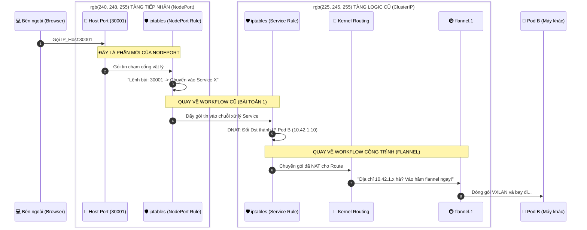

# Kubernetes NodePort Networking

## k8s NodePort Service: Luồng dữ liệu và NAT

### 3 Điểm "Chốt" để bạn không bao giờ nhầm lẫn:

1. **Tính đồng nhất**: NodePort mở trên tất cả các node vì kube-proxy chạy trên tất cả các node. Nó nạp cùng một bộ quy tắc iptables giống hệt nhau vào mọi máy Host.

2. **Sự kế thừa**: K8s không viết lại logic mới cho NodePort. Nó chỉ tạo ra một quy tắc iptables ở tầng trên cùng (Chain KUBE-NODEPORTS) để "nhảy" vào quy tắc của Service (Chain KUBE-SERVICES).

3. **Điểm mù (Sự lãng phí)**: Đây là điểm bạn cần lưu ý: Nếu bạn gọi vào Host A, nhưng Pod lại ở Host B, gói tin phải đi vòng: User ➔ Host A ➔ Host B. Điều này làm tăng độ trễ (latency).
