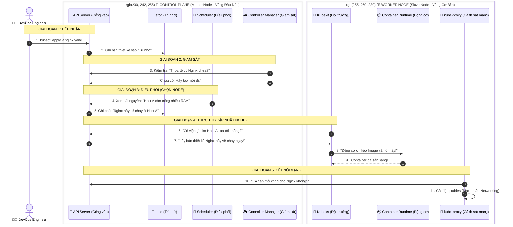

# Kubernetes Architecture

## Sequence Diagram

## Giải thích các thành phần

| Thành phần | Tên kỹ thuật | Chức năng (Dễ hiểu) |
| :--- | :--- | :--- |
| Cái miệng & Tai | kube-apiserver | Tiếp nhận lệnh từ bạn (kubectl) và là trung tâm liên lạc giữa các bộ phận. |
| Trí nhớ (DB) | etcd | Cuốn sổ cái lưu trạng thái của toàn bộ hệ thống. Chỉ API Server mới được ghi vào đây. |
| Người điều phối | kube-scheduler | Tính toán: "Pod này nên nằm ở Node nào thì hợp lý nhất?". |
| Người giám sát | kube-controller-manager | Đảm bảo thực tế luôn khớp với mong muốn (Ví dụ: Chết 1 Pod là ra lệnh tạo lại ngay). |
| Đội trưởng Node | kubelet | "Đại sứ" của Master trên mỗi Node, quản lý trực tiếp vòng đời của Container. |
| Cảnh sát GT | kube-proxy | Quản lý mạng, cài đặt iptables (thứ chúng ta đã học rất kỹ). |
| Động cơ | Container Runtime | Phần mềm thực sự để chạy container (thường là containerd). |
