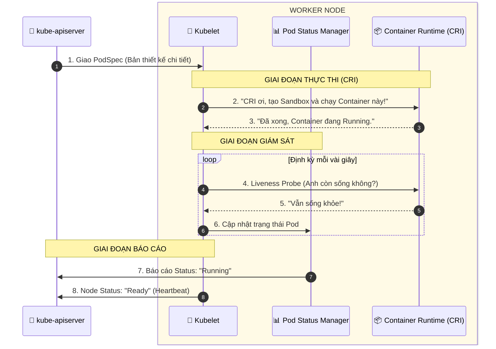

# Kubelet Architecture

## Sequence Diagram

## Chức năng của Kubelet

Hãy tưởng tượng Kubelet như một người quản đốc tại công trường (Node):

- **Tiếp nhận bản thiết kế:** Nó không nhìn vào YAML của bạn, nó nhìn vào các PodSpec mà API Server gửi tới.
- **Điều hành động cơ:** Nó ra lệnh cho Container Runtime (Containerd) chạy hoặc dừng Container.
- **Giám sát sức khỏe:** Nó kiểm tra xem Container có còn sống không. Nếu "ngỏm", nó sẽ tự động khởi động lại (Restart Policy).
- **Báo cáo thành tích:** Định kỳ, nó gửi "nhịp tim" (Heartbeat) về Master để báo: "Tôi vẫn khỏe, các Pod vẫn chạy tốt".
